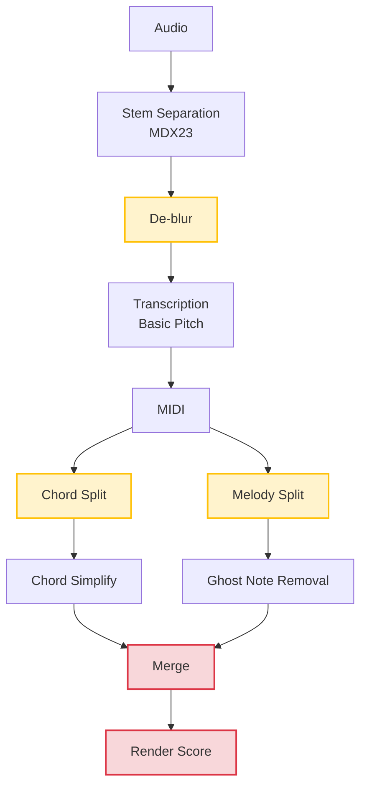

```mermaid
flowchart TD
    A[Audio] --> B[Stem Separation<br/>MDX23]
    B --> C[De-blur]
    C --> D[Transcription<br/>Basic Pitch]
    D --> E[MIDI]
    
    %% MIDI splits into three paths
    E --> H[Melody Split]
    E --> I[Chord Split]
    H --> J[Ghost Note Removal]
    
    %% Chord processing
    I --> K[Chord Simplify]
    
    %% Merge everything
    K --> N[Merge]
    J --> N
    
    %% Final output
    N --> O[Render Score]
    
    %% Styling
    classDef optional fill:#e8f5e8,stroke:#28a745,stroke-width:2px
    classDef process fill:#fff3cd,stroke:#ffc107,stroke-width:2px
    classDef output fill:#f8d7da,stroke:#dc3545,stroke-width:2px
    classDef logic fill:#e9ecef,stroke:#6c757d,stroke-width:2px
    
    class F,G optional
    class C,H,I,L,M process
    class N,O output
    class L,M logic
```